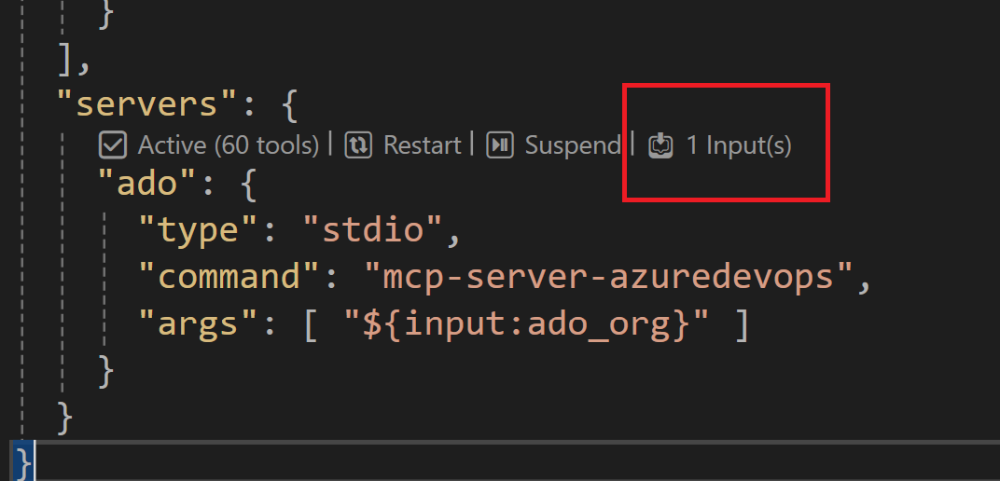
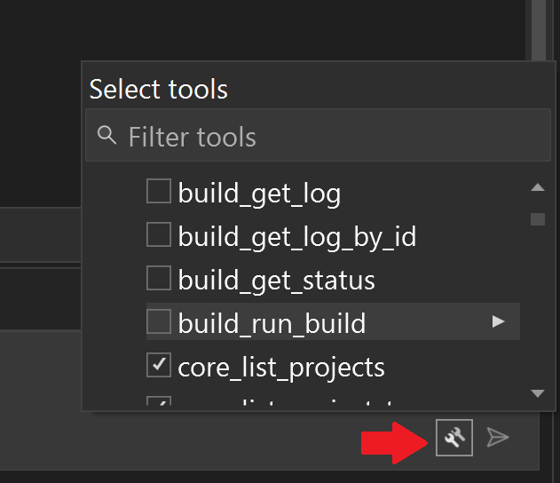

# 🚀 Getting Started with Azure DevOps MCP Server

This guide will help you get started with the Azure DevOps MCP Server in different environments.

- [Prerequisites](#-prerequisites)
- [Getting started with Visual Studio Code & GitHub Copilot](#️-visual-studio-code--github-copilot)
- [Getting started with Visual Studio 2022 & GitHub Copilot](#-visual-studio-2022--github-copilot-1)
- [Getting started with Claude Code](#-using-mcp-server-with-claude-code)
- [Getting started with Cursor](#-using-mcp-server-with-cursor)
- [Optimizing Your Experience](#-optimizing-your-experience)

## 🕐 Prerequisites

For the best experience, use Visual Studio Code and GitHub Copilot.

Before you begin, make sure you have:

### For Visual Studio Code

1. Install [VS Code](https://code.visualstudio.com/download) or [VS Code Insiders](https://code.visualstudio.com/insiders)
2. Install [Node.js](https://nodejs.org/en/download) 20+
3. Install [Azure CLI](https://learn.microsoft.com/en-us/cli/azure/install-azure-cli?view=azure-cli-latest)
4. Open VS Code in an empty folder

### For Visual Studio 2022

1. Install [VS Studio 2022 version 17.14](https://learn.microsoft.com/en-us/visualstudio/releases/2022/release-history) or later
2. Install [Azure CLI](https://learn.microsoft.com/en-us/cli/azure/install-azure-cli?view=azure-cli-latest)
3. Open a project in Visual Studio

### Azure Login

Ensure you are logged in to Azure DevOps via the Azure CLI:

```sh
az login
```

## 🍕 Installation Options

### ➡️ Visual Studio Code & GitHub Copilot

For the best experience, use Visual Studio Code and GitHub Copilot.

#### ✨ One-Click Install

[](https://insiders.vscode.dev/redirect/mcp/install?name=ado&config=%7B%20%22type%22%3A%20%22stdio%22%2C%20%22command%22%3A%20%22npx%22%2C%20%22args%22%3A%20%5B%22-y%22%2C%20%22%40azure-devops%2Fmcp%22%2C%20%22%24%7Binput%3Aado_org%7D%22%5D%7D&inputs=%5B%7B%22id%22%3A%20%22ado_org%22%2C%20%22type%22%3A%20%22promptString%22%2C%20%22description%22%3A%20%22Azure%20DevOps%20organization%20name%20%20%28e.g.%20%27contoso%27%29%22%7D%5D)
[](https://insiders.vscode.dev/redirect/mcp/install?name=ado&quality=insiders&config=%7B%20%22type%22%3A%20%22stdio%22%2C%20%22command%22%3A%20%22npx%22%2C%20%22args%22%3A%20%5B%22-y%22%2C%20%22%40azure-devops%2Fmcp%22%2C%20%22%24%7Binput%3Aado_org%7D%22%5D%7D&inputs=%5B%7B%22id%22%3A%20%22ado_org%22%2C%20%22type%22%3A%20%22promptString%22%2C%20%22description%22%3A%20%22Azure%20DevOps%20organization%20name%20%20%28e.g.%20%27contoso%27%29%22%7D%5D)

After installation, select GitHub Copilot Agent Mode and refresh the tools list. Learn more about Agent Mode in the [VS Code Documentation](https://code.visualstudio.com/docs/copilot/chat/chat-agent-mode).

#### 🧨 Install from Public Feed (Recommended)

This installation method is the easiest for all users of Visual Studio Code.

🎥 [Watch this quick start video to get up and running in under two minutes!](https://youtu.be/EUmFM6qXoYk)

##### Steps

In your project, add a `.vscode\mcp.json` file with the following content:

```json
{
  "inputs": [
    {
      "id": "ado_org",
      "type": "promptString",
      "description": "Azure DevOps organization name  (e.g. 'contoso')"
    }
  ],
  "servers": {
    "ado": {
      "type": "stdio",
      "command": "npx",
      "args": ["-y", "@azure-devops/mcp", "${input:ado_org}"]
    }
  }
}
```

Save the file, then click 'Start'.


In chat, switch to [Agent Mode](https://code.visualstudio.com/blogs/2025/02/24/introducing-copilot-agent-mode).

Click "Select Tools" and choose the available tools.


> 💥 We strongly recommend creating a `.github\copilot-instructions.md` in your project and copying the contents from this [copilot-instructions.md](../.github/copilot-instructions.md) file. This will enhance your experience using the Azure DevOps MCP Server with GitHub Copilot Chat.

##### Start using it

1. Open GitHub Copilot in VS Code and switch to Agent mode.
2. Start the Azure DevOps MCP Server.
3. The server appears in the tools list.
4. Try prompts like "List ADO projects".

#### 🛠️ Install from Source (Dev Mode)

This installation method is recommended for advanced users and contributors who want immediate access to the latest updates from the main branch. It is ideal if you are developing new tools, enhancing existing features, or maintaining a custom fork.

> **Note:** For most users, installing from the public feed is simpler and preferred. Use the source installation only if you need the latest changes or are actively contributing to the project.

##### Steps

Clone the repository.

Install dependencies:

```sh
npm install
```

Edit or add `.vscode/mcp.json`:

```json
{
  "inputs": [
    {
      "id": "ado_org",
      "type": "promptString",
      "description": "Azure DevOps organization's name  (e.g. 'contoso')"
    }
  ],
  "servers": {
    "ado": {
      "type": "stdio",
      "command": "mcp-server-azuredevops",
      "args": ["${input:ado_org}"]
    }
  }
}
```

Start the Azure DevOps MCP Server.


In chat, switch to [Agent Mode](https://code.visualstudio.com/blogs/2025/02/24/introducing-copilot-agent-mode).

Click "Select Tools" and choose the available tools.


> 💥 We strongly recommend creating a `.github\copilot-instructions.md` in your project and copying the contents from this [copilot-instructions.md](../.github/copilot-instructions.md) file. This will help you get the best experience using the Azure DevOps MCP Server in GitHub Copilot Chat.

### ➡️ Visual Studio 2022 & GitHub Copilot

For the best experience, use Visual Studio Code and GitHub Copilot 👆.

#### 🧨 Install from Public Feed (Recommended)

This installation method is the easiest for all users of Visual Studio 2022.

🎥 [Watch this quick start video to get up and running in under two minutes!](https://youtu.be/nz_Gn-WL7j0)

##### Steps

Add a `.mcp.json` file to the solution folder with the following content:

```json
{
  "inputs": [
    {
      "id": "ado_org",
      "type": "promptString",
      "description": "Azure DevOps organization name  (e.g. 'contoso')"
    }
  ],
  "servers": {
    "ado": {
      "type": "stdio",
      "command": "npx",
      "args": ["-y", "@azure-devops/mcp", "${input:ado_org}"]
    }
  }
}
```

Save the file.

Add your organization name by clicking on the `input` option.



Open Copilot chat and switch to [Agent Mode](https://learn.microsoft.com/en-us/visualstudio/ide/copilot-agent-mode?view=vs-2022).

Click the "Tools" icon and choose the available tools.



> 💥 We strongly recommend creating a `.github\copilot-instructions.md` in your project and copying the contents from this [copilot-instructions.md](../.github/copilot-instructions.md) file. This will enhance your experience using the Azure DevOps MCP Server with GitHub Copilot Chat.

##### Start using it

> _Prerequisites:_ Visual Studio 2022 v17.14+, Agent mode enabled in Tools > Options > GitHub > Copilot > Copilot Chat.

1. Switch to Agent mode in the Copilot Chat window.
2. Enter your Azure DevOps organization name.
3. Select desired `ado` tools.
4. Try prompts like "List ADO projects".

For more details, see [Visual Studio MCP Servers documentation](https://learn.microsoft.com/en-us/visualstudio/ide/mcp-servers?view=vs-2022) and the [Getting Started Video](https://www.youtube.com/watch?v=oPFecZHBCkg).

### 🤖 Using MCP Server with Claude Code

See https://docs.anthropic.com/en/docs/claude-code/mcp for general guidance on adding MCP Server to Claude Code experience.

For the Azure DevOps MCP Server, use the following command:

```bash
claude mcp add azure-devops -- npx -y @azure-devops/mcp Contoso
```

Replace `Contoso` with your own organization name

### 🍇 Using MCP Server with Cursor

To integrate the Azure DevOps MCP Server with Cursor, create a `.cursor\mcp.json` file and add your Azure DevOps organization to the `mcpServers` list.

```json
{
  "mcpServers": {
    "ado": {
      "command": "npx",
      "args": ["-y", "@azure-devops/mcp", "{Contoso}"]
    }
  }
}
```

Replace `{Contoso}` with your actual Azure DevOps organization name.

Save the file, and when Cursor detects the MCP Server, click **Enable**.


#### Start the Azure DevOps MCP Server

Open the terminal and start the MCP Server with:

```bash
npx -y @azure-devops/mcp {Contoso}
```

Replace `Contoso` with your Azure DevOps organization.

You can now use the Azure DevOps MCP Server tools directly in chat.

📽️ [Azure DevOps MCP Server: Getting started with Cursor](https://youtu.be/550VPTnjYRg)
