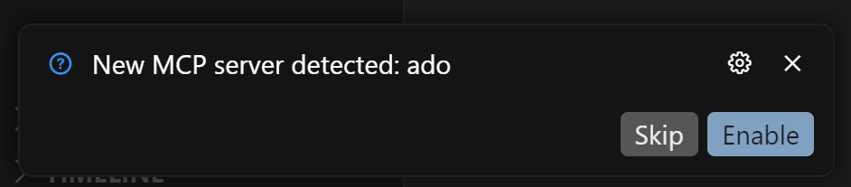

Before you get started, ensure you follow the steps in the `README.md` file. This will help you get up and running and connected to your Azure DevOps organization.

[🥇 How to make your experience better](#-how-to-make-your-experience-better)<br/>
[🚗 Using MCP Server with Visual Studio Code](#-using-mcp-server-with-visual-studio-code)<br/>
[🤖 Using MCP Server with Claude Code](#-using-mcp-server-with-claude-code)<br/>
[🍇 Using MCP Server with Cursor](#-using-mcp-server-with-cursor)<br/>

# 🥇 How to make your experience better

### Modify Copilot Instructions

The `.github/copilot-instructions.md` file is a great way to customize the GitHub Copilot experience, especially when working with MCP Server for Azure DevOps.

From the [GitHub documentation](https://docs.github.com/en/copilot/customizing-copilot/adding-repository-custom-instructions-for-github-copilot):

> Instead of repeatedly adding this contextual detail to your chat questions, you can create a file in your repository that automatically adds this information for you. The additional information is not displayed in the chat but is available to Copilot to allow it to generate higher-quality responses.

#### Example Modification

Here is an example modification you can add to your existing `.github/copilot-instructions.md` file.

```markdown
## Using MCP Server for Azure DevOps

When getting work items using MCP Server for Azure DevOps, always try to use batch tools for updates instead of many individual single updates. For updates, try and update up to 200 updates in a single batch. When getting work items, once you get the list of IDs, use the tool `get_work_items_batch_by_ids` to get the work item details. By default, show fields ID, Type, Title, State. Show work item results in a rendered markdown table.
```

### Use different models

Communicating with the LLM is both an art and a science. If the model does not respond well, switching to a different model may improve your results.

# 🚗 Using MCP Server with Visual Studio Code

### Start the Azure DevOps MCP Server

To start the Azure DevOps MCP Server, open the `.vscode\mcp.json` file and click 'Start'


Enter your Azure DevOps organization name (e.g. `contoso`).

In chat, switch to [Agent Mode](https://code.visualstudio.com/blogs/2025/02/24/introducing-copilot-agent-mode).

### Enable or disable tools

Click "Select Tools" and choose the available tools.


## 📽️ Examples

> 📝 These examples have been tested and validated only in English. If you encounter issues when using a different language, please open an issue in the repository so we can investigate.

### Projects and teams

Most work item tools require project context. You can retrieve the list of projects and specify the desired project:

```plaintext
get list of ado projects
```

This command returns all Azure DevOps projects for the organization defined in the `mcp.json` file. Similarly, you can retrieve the team context:

```plaintext
get list of teams for project contoso
```

📽️ [Azure DevOps MCP Server: Get list of projects and teams](https://youtu.be/x579E4_jNtY)

### Get my work items

Retrieve a list of work items assigned to you. This tool requires project context:

```plaintext
get my work items for project contoso
```

The model should automatically use the `wit_get_work_items_batch_by_ids` tool to fetch work item details.

📽️ [Azure DevOps MCP Server: Get my work items](https://youtu.be/y_ri8n7mBlg)

### Get all work items in a backlog

You need project, team and backlog (Epics, Stories, Features) context in order to get a list of all the work items in a backlog.

```plaintext
get backlogs for Contoso project and Fabrikam team
```

Once you have the backlog levels, you can then get work items for that backlog.

```plaintext
get list of work items for Features backlog
```

The model should automatically use the `wit_get_work_items_batch_by_ids` tool to fetch work item details.

📽️ [Azure DevOps MCP Server: Get backlog](https://youtu.be/LouuyoscNrI)

### Retrieve and edit work items

Get a work item, get the work item comments, update the work item fields, and add a new comment.

```plaintext
Get work item 12345 and show me fields ID, Type, State, Repro Steps, Story Points, and Priority. Get all comments for the work item and summarize them for me.
```

The model now has context of the work item. You can then update specific fields. In this case, we want the LLM to generate a better set of Repro Steps and then update the work item with those new steps. Along with updating the Story Points and State fields.

```plaintext
Polish the Repro Steps with more information and details. Then take that value and update the work item. Also update StoryPoints = 5 and State = Active.
```

Assign the work item to me and add a new comment.

```plaintext
Assign this work item to myemail@outlook.com and add a comment "I will own this Bug and get it fixed"
```

📽️ [Azure DevOps MCP Server: Work with Work Items](https://youtu.be/tT7wqSIPKdA)

### Create and link test cases

Open a user story and automatically generate test cases with detailed steps based on the story's description. Link the generated test cases back to the original user story.

```plaintext
Open work item 1234 in 'Contoso' project. Then look at the description and create 1-3 Test Cases with test steps. But show me a preview first before creating the Test Case in Azure DevOps. Be sure to link the new Test Case to the User Story 1234 when you do.
```

📽️ [Azure DevOps MCP Server: Creating Test Cases from Work Item](https://youtu.be/G7fnYjlSh_w)

### Triage work

Retrieve all work items in a backlog and triage them according to your own criteria. For example, you can fetch all bugs and user stories, identify security-related bugs, and assign them to the current team iteration. Similarly, you can select a few high-priority user stories and assign them to the most recent iteration.

Retrieve the team's iterations and backlog levels to provide the LLM with the necessary context for accurate work item management.

```plaintext
list iterations for Contoso team
```

```plaintext
list backlog levels for Contoso team
```

Retrieve the work items and their details, then instruct the LLM to identify security-related bugs and high-priority user stories. Assign the identified items to the current iteration and, if needed, to the next iteration.

```plaintext
List of work items for Stories backlog. But then go thru and find all the security related bugs. Assign the first 4 to the current iteration. If there are more than four, assign the rest to the next iteration. Then find 2-3 high priority user stories and assign them to the current iteration. Do it!
```

📽️ [Azure DevOps MCP Server: Triage Work](https://youtu.be/gCI_pPS76C8)

### Adding and updating work items using the `format` paramater

You can use the `format` paramater to indicate markdown formatting for large text fields. It is now available on the following tools:

- **wit_update_work_items_batch**
- **wit_add_child_work_items**
- **wit_create_work_item**

> 🚩 HTML is the default unless `Markdown` is explicity set.

```plaintext
Update work item 12345 with a new description and use Markdown text. Use Markdown format param. Use bulk update.
```

📽️ [Azure DevOps MCP Server: Using Markdown format for create and update work items](https://youtu.be/OD4c2m7Fj9U)

# 🤖 Using MCP Server with Claude Code

See https://docs.anthropic.com/en/docs/claude-code/mcp for general guidance on adding MCP Server to Claude Code experience.

For the Azure DevOps MCP Server, use the following command:

```
claude mcp add azure-devops -- npx -y @azure-devops/mcp Contoso
```

Replace `Contoso` with your own organization name

# 🍇 Using MCP Server with Cursor

To integrate the Azure DevOps MCP Server with Cursor, create a `.cursor\mcp.json` file and add your Azure DevOps organization to the `mcpServers` list.

```json
{
  "mcpServers": {
    "ado": {
      "command": "npx",
      "args": ["-y", "@azure-devops/mcp", "{Contoso}"]
    }
  }
}
```

Replace `{Contoso}` with your actual Azure DevOps organization name.

Save the file, and when Cursor detects the MCP Server, click **Enable**.



### Start the Azure DevOps MCP Server

Open the terminal and start the MCP Server with:

```
npx -y @azure-devops/mcp {Contoso}
```

Replace `Contoso` with your Azure DevOps organization.

You can now use the Azure DevOps MCP Server tools directly in chat.

📽️ [Azure DevOps MCP Server: Getting started with Cursor](https://youtu.be/550VPTnjYRg)
